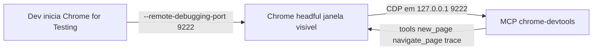

# MCP chrome-devtools — Receita prompt-and-play (Chrome for Testing + remote debugging)

Receita canônica para usar o MCP `chrome-devtools` em **modo headful** (janela visível) neste ambiente. O MCP **não** lança o próprio Chrome — ele **conecta** a uma instância de Chrome que o dev inicia manualmente com a porta de debug aberta. O usuário exige headful; NÃO cair para headless.

## Modelo de operação

A config do MCP (`~/.kiro/settings/mcp.json`) usa `--browser-url=http://127.0.0.1:9222`. Isso significa:

- O **dev** inicia o Chrome for Testing com `--remote-debugging-port=9222`.
- O **MCP** apenas se conecta a essa instância já rodando.
- Não há dependência de `DISPLAY`/`XAUTHORITY` no processo do MCP — quem abre a janela é o Chrome que o dev lançou na própria sessão gráfica, que já herda o ambiente X/Wayland correto.



## Passo 1 — Baixar o Chrome for Testing

Usar o **Chrome for Testing** (binário estável e versionado, próprio para automação), não o Chrome/Chromium do sistema.

- Página oficial de downloads: https://googlechromelabs.github.io/chrome-for-testing/
- Baixar o build `stable` para `linux64`, extrair, e localizar o binário `chrome` (ex.: `chrome-linux64/chrome`).

Alternativa via `npx`/`vpx` (baixa e resolve o caminho do binário):

```bash
vpx @puppeteer/browsers install chrome@stable
```

## Passo 2 — Iniciar o Chrome com a porta de debug

Comando canônico (headful, com perfil dedicado e descartável):

```bash
./chrome --remote-debugging-port=9222 --user-data-dir=/tmp/chrome-debug
```

- `--remote-debugging-port=9222` — abre o endpoint CDP que o MCP consome. **Tem que ser 9222** (é o que está no `--browser-url` do `mcp.json`).
- `--user-data-dir=/tmp/chrome-debug` — perfil isolado; evita conflito com o Chrome pessoal e mantém a sessão de debug limpa.
- Rodar no **terminal do usuário** (sessão gráfica ativa) para a janela aparecer. Deixar o processo vivo enquanto usa o MCP.

> Substituir `./chrome` pelo caminho real do binário do Chrome for Testing (ex.: `~/chrome-linux64/chrome` ou o caminho retornado pelo `@puppeteer/browsers install`).

## Passo 3 — Config do MCP (já aplicada)

Bloco `chrome-devtools` em `~/.kiro/settings/mcp.json`. Conecta via `--browser-url`; sem `--headless`, sem `DISPLAY`/`XAUTHORITY`:

```json
"chrome-devtools": {
  "command": "/bin/sh",
  "args": [
    "-c",
    "DISPLAY=:0 exec /home/jeudi/.vite-plus/bin/vpx chrome-devtools-mcp@latest --browser-url=http://127.0.0.1:9222"
  ],
  "env": {
    "HTTPS_PROXY": "http://proxy.el.com.br:3128",
    "HTTP_PROXY": "http://proxy.el.com.br:3128",
    "ALL_PROXY": "http://proxy.el.com.br:3128",
    "NO_PROXY": "localhost,127.0.0.1,::1"
  },
  "disabled": false
}
```

- `--browser-url=http://127.0.0.1:9222` — conecta ao Chrome do Passo 2. Este é o ponto central da receita.
- `NO_PROXY` isenta `localhost`/`127.0.0.1` do proxy corporativo — sem isso a conexão CDP local pode ser roteada ao proxy e falhar.
- O agente **não** tem permissão de escrita nesse arquivo — se precisar mudar, orientar o dev a editar.

## Checklist de uso (prompt-and-play)

1. Chrome for Testing baixado (Passo 1).
2. Chrome rodando: `./chrome --remote-debugging-port=9222 --user-data-dir=/tmp/chrome-debug` (Passo 2), janela visível, processo vivo.
3. Endpoint CDP no ar: `curl -s http://127.0.0.1:9222/json/version` retorna JSON com `Browser`/`webSocketDebuggerUrl`.
4. MCP `chrome-devtools` habilitado no `mcp.json` (Passo 3).
5. Validar com uma tool leve: `new_page` para `http://localhost:3000` (ou a URL do app) deve listar a página sem erro.

## Diagnóstico rápido (quando falhar)

- **MCP não conecta / "failed to connect to browser"**: o Chrome do Passo 2 não está rodando ou está em outra porta. Conferir:
  ```bash
  curl -s http://127.0.0.1:9222/json/version    # deve retornar JSON; se recusar conexao, o Chrome nao esta na 9222
  ```
- **Conexão local roteada ao proxy**: garantir `NO_PROXY=localhost,127.0.0.1,::1` no `env` do bloco.
- **Porta 9222 ocupada por outra instância**: matar o Chrome de debug antigo ou usar outro `--user-data-dir`. Um único endpoint 9222 por vez.
- **Janela não aparece (headful)**: o Chrome precisa ser iniciado na sessão gráfica do usuário (terminal com `DISPLAY`/Wayland herdados do login), não dentro do processo do MCP.
- **App fora do ar ≠ erro do MCP**: confirmar o app antes: `curl -s -o /dev/null -w "%{http_code}" http://localhost:3000`.

## Regras

- Headful é requisito do usuário. **NUNCA** trocar para `--headless` sem autorização explícita.
- A instância do Chrome é responsabilidade do **dev** (Passo 2). O agente não inicia o Chrome de debug por conta própria; se o MCP não conectar, orientar o dev a rodar o comando do Passo 2.
- Manter a porta **9222** alinhada entre o comando do Chrome (`--remote-debugging-port`) e o `--browser-url` do `mcp.json`.
- O agente não edita `~/.kiro/settings/mcp.json` (bloqueado por permissão) — apresentar o bloco pronto e pedir para o dev aplicar e reiniciar o server (toggle `disabled: true` → salvar → `disabled: false`).
