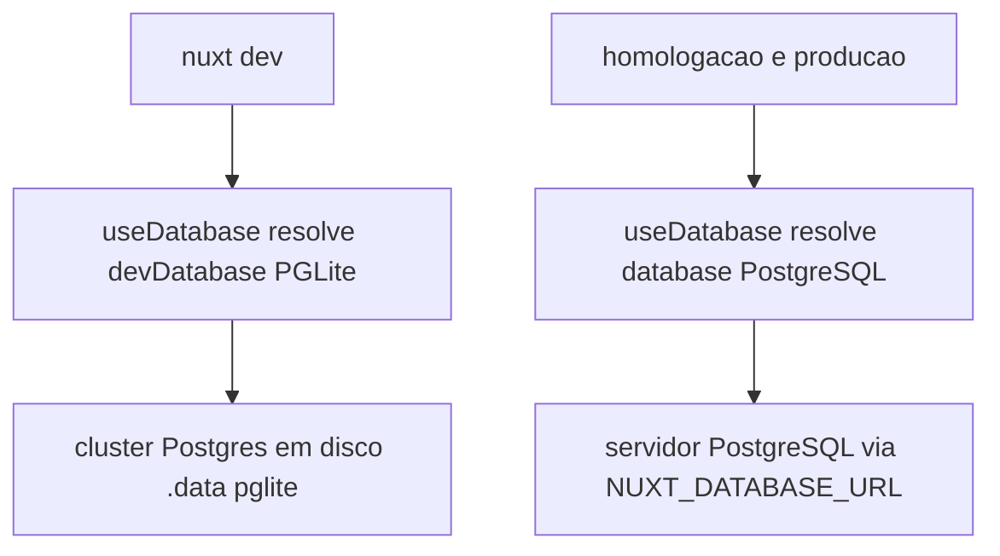

# Banco de Dados — Camada nativa do Nitro (db0)

Como este projeto acessa banco: **camada nativa do Nitro** (db0), com PGLite embarcado em
desenvolvimento local e PostgreSQL em homologação/produção. Um dialeto SQL único (Postgres) serve
aos dois ambientes. Complementa (não substitui):
- [db-read-only](db-read-only.md) — a conexão **interativa do agente** é read-only; o **código da aplicação** grava normalmente.
- [nuxt-server-db-postgresql](nuxt-server-db-postgresql.md) — leitura de catálogos `pg_*` (introspeção), assunto distinto de persistência de domínio.
- [nuxt-config-canonico](nuxt-config-canonico.md) / [deploy-bun-producao](deploy-bun-producao.md) — o resto do `nuxt.config`.

## 1. Arquitetura — resolução por ambiente

A conexão é resolvida pelo Nitro via `nuxt.config.ts`, não por código:

```ts [nuxt.config.ts]
nitro: {
  experimental: { database: true },        // habilita useDatabase() auto-import no server
  database: {                               // homologação/produção
    default: {
      connector: 'postgresql',
      options: { url: process.env.NUXT_DATABASE_URL },
    },
  },
  devDatabase: {                            // desenvolvimento local (SUBSTITUI database em dev)
    default: {
      connector: 'pglite',
      options: { dataDir: './.data/pglite' },
    },
  },
}
```

Pontos que não podem ser esquecidos:

- **`devDatabase` SUBSTITUI `database` por completo em dev** — não há merge por nome de conexão. Toda conexão necessária em dev precisa estar redeclarada em `devDatabase`.
- **PGLite grava em disco, não em memória.** `dataDir: './.data/pglite'` (sem prefixo de scheme) usa filesystem — é um cluster Postgres persistente em `.data/pglite/`. Só seria efêmero com `memory://`. `.data/` está no `.gitignore` (cada dev tem o próprio banco).
- **PGLite é single-connection.** Um único processo por vez abre o `dataDir`. O migrador (predev) fecha a conexão antes de o `nuxt dev` subir. Não rodar um script que abra o PGLite com o dev server no ar → dá lock.
- **Dialeto único (Postgres).** PGLite fala Postgres, então PGLite (dev) e PostgreSQL (prod) usam o mesmo SQL. Não existe mais dialeto SQLite no projeto.



## 2. Acesso no código — `useDatabase()` async

`useDatabase()` é **auto-importado no server** (habilitado por `experimental.database`). A API do db0
é **assíncrona** — toda função de acesso é `async` e todo handler que a usa também.

```ts [server/utils/banco.ts]
export async function inserirLink(dados: NovoLink): Promise<void> {
  const db = useDatabase()
  await db.sql`
    INSERT INTO links (escopo, entropia, checksum, url_destino, criado_por, expira_em)
    VALUES (${dados.escopo}, ${dados.entropia}, ${dados.checksum}, ${dados.urlDestino}, ${dados.criadoPor ?? 'anonimo'}, ${dados.expiraEm})
  `
}

export async function buscarLinkPorEntropia(entropia: string): Promise<LinkPersistido | null> {
  const db = useDatabase()
  const { rows } = await db.sql<{ rows: LinhaLink[] }>`
    SELECT id, escopo, entropia, checksum, url_destino, criado_por, expira_em, criado_em, total_acessos
    FROM links WHERE entropia = ${entropia}
  `
  const linha = rows?.[0]
  return linha ? mapear(linha) : null
}
```

Regras de uso do `db.sql`:

- **Interpolação `${x}` no tagged template é parametrizada** (seguro contra injeção). Não concatenar valores na string. O connector reescreve `?`/`${}` para `$n` do Postgres.
- **O generic de `db.sql<T>` é o resultado inteiro**, não só as linhas: use `db.sql<{ rows: LinhaLink[] }>` e leia `.rows`.
- **`id` é `GENERATED ALWAYS AS IDENTITY`** — nunca inserir `id` no INSERT.
- **Coagir tipos na borda** (regra tipos-numericos): `bigint`/`count()` do `pg` chegam como **string** → `Number(...)`. `timestamptz` pode vir como `Date` (pg) ou `string` (pglite) → normalizar para string ISO. Ver `LinhaLink`/`normalizarData` em `banco.ts`.
- Handler que chama essas funções precisa ser `async` e usar `await` (ex.: a rota de resolução `server/routes/[escopo]/[codigo].get.ts` é `defineEventHandler(async (event) => ...)`).

> **Relação com db-read-only.** Escrever `INSERT`/`UPDATE` no código de `server/**` é a aplicação gravando em runtime — permitido e normal. A proibição read-only vale só para o agente rodar SQL de escrita no chat (psql/sqlite CLI).

## 3. Migrations — dialeto único, manuais, SÓ em dev local

Não há sistema de migration nativo no Nitro/db0 (só a camada de query). O gerenciamento é manual.

- **Fonte única:** `db/migrations/*.sql` (dialeto Postgres). Ordem por prefixo numérico (`001_`, `002_`). Sem pasta `sqlite` — foi aposentada.
- **Dev local:** aplicadas automaticamente pelo migrador `db/migrar-pglite.mjs`, chamado no `predev` (e `db:migrate`) do `package.json`. Abre o **mesmo** `dataDir` do PGLite, controla aplicadas em `_migrations`, transação por arquivo, idempotente.
- **Homologação/produção:** aplicadas **MANUALMENTE pela equipe de deploy** no PostgreSQL. O migrador **NUNCA** roda fora do dev local.

### Guarda anti-produção (fail-closed) — obrigatória

O migrador aborta **antes de abrir qualquer conexão** se detectar produção ou alvo Postgres real:

```js
if (process.env.NODE_ENV === 'production') abortar()
if (process.env.NUXT_DATABASE_URL) abortar()   // presença de URL = alvo PostgreSQL (homolog/prod)
if (process.env.DATABASE_URL) abortar()
```

Qualquer novo caminho de migração (seed, migração ad-hoc) deve manter a mesma guarda: só PGLite, só `.data/pglite`, nunca em outro ambiente.

### Por que NÃO Nitro Task para migrar

Nitro Tasks exigem o server no ar (dependência circular com o `predev`, que roda **antes** do `nuxt dev`) e rodam dentro do runtime — o mesmo runtime que em produção fica no ar, o que enfraquece a guarda anti-produção. Migração de schema fica como script `.mjs` isolado no `predev`. Tasks podem servir para operações on-demand em dev (seed, cache clear), nunca para migração de schema.

## 4. Layout de arquivos

```
db/
├─ migrar-pglite.mjs           # migrador dev-only (guarda anti-produção)
└─ migrations/
   └─ 001_criar_tabela_links.sql   # schema Postgres — fonte única (PGLite dev + PostgreSQL prod)
```

`package.json`: `"predev": "node db/migrar-pglite.mjs"`, `"db:migrate": "node db/migrar-pglite.mjs"`.

## 5. Dependências

- `@electric-sql/pglite` — connector `pglite` (dev). PGLite embarcado.
- `pg` + `@types/pg` — connector `postgresql` (homolog/prod).

`NUXT_DATABASE_URL` documentada em `.env.example`; em dev pode ficar ausente (PGLite assume via `devDatabase`). Definir a URL em dev **ativa a guarda** e o migrador passa a abortar — é o comportamento esperado.

## 6. Checklist ao mexer em banco

1. Acesso via `useDatabase()` async (`await db.sql`), nunca `node:sqlite` nem driver manual.
2. Handler que persiste/lê é `async` com `await`.
3. Valores via interpolação parametrizada do `db.sql` (sem concatenar).
4. `bigint`/`count` → `Number()`; `timestamptz` → string ISO na borda.
5. Migration nova em `db/migrations/NNN_*.sql` (dialeto Postgres), testada localmente com `pnpm db:migrate`.
6. Migrador mantém a guarda anti-produção. Prod é migrado à mão pelo deploy.
7. Parar o dev server antes de abrir o PGLite noutro processo (single-connection).
